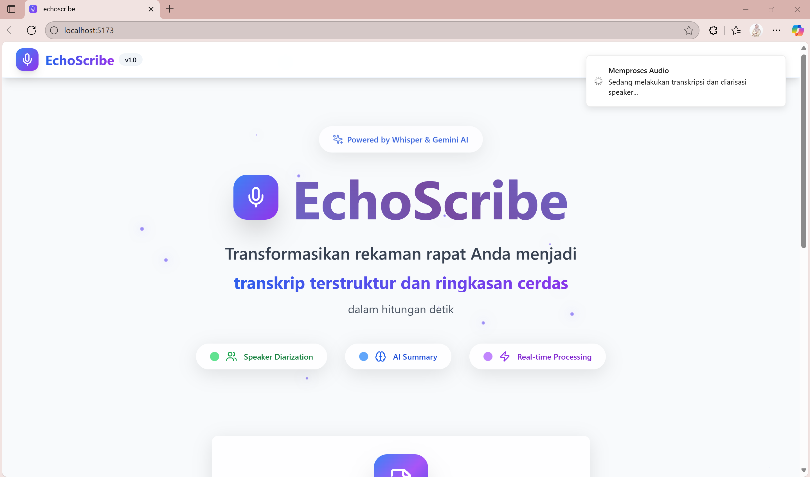
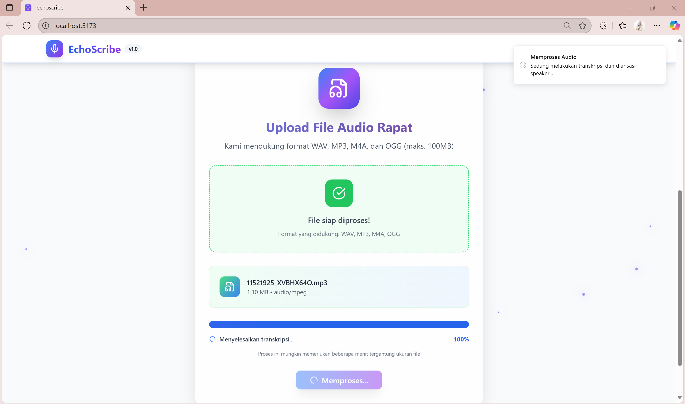
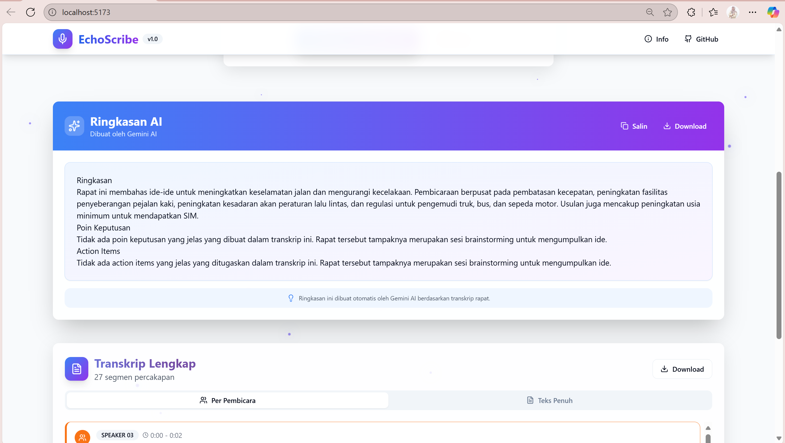
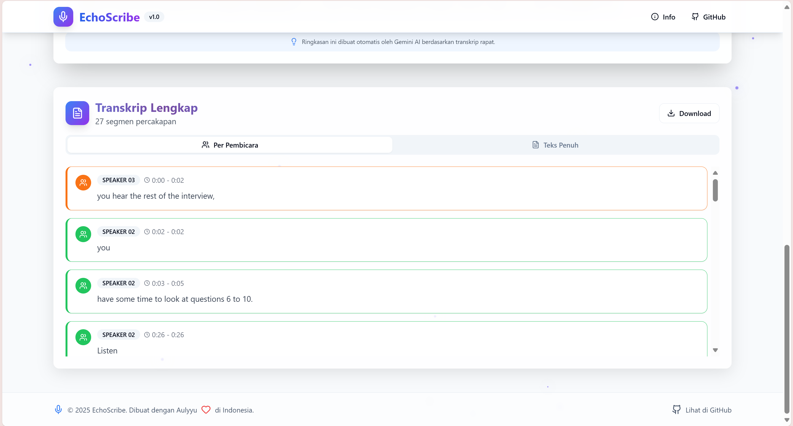

# EchoScribe 🚀

[](https://opensource.org/licenses/MIT)

EchoScribe adalah aplikasi canggih yang mentransformasikan rekaman audio rapat menjadi transkrip terstruktur dan ringkasan cerdas. Dibangun dengan teknologi AI terdepan, EchoScribe membantu Anda menghemat waktu dan fokus pada hal-hal yang paling penting.

---

### ✨ Fitur Utama

* **Transkripsi Akurat**: Menggunakan model **Whisper** dari OpenAI untuk mengubah audio menjadi teks dengan tingkat akurasi yang tinggi.
* **Identifikasi Pembicara (Speaker Diarization)**: Memanfaatkan **Pyannote.audio** untuk mendeteksi dan memisahkan ucapan dari setiap pembicara dalam rekaman.
* **Ringkasan AI Cerdas**: Didukung oleh **Google Gemini**, aplikasi ini secara otomatis membuat ringkasan rapat, mengidentifikasi poin keputusan, dan mencatat *action items*.
* **Antarmuka Modern**: UI yang bersih dan intuitif untuk pengalaman pengguna yang lancar.
* **Mendukung Berbagai Format**: Unggah file audio dalam format populer seperti WAV, MP3, M4A, dan OGG.

---

### 📸 Tangkapan Layar Aplikasi

Berikut adalah tampilan dari aplikasi EchoScribe saat digunakan.

**1. Halaman Utama**
*Tampilan awal yang modern dan informatif.*


**2. Proses Unggah File**
*Cukup seret dan lepas (drag-and-drop) file audio Anda. Proses transkripsi akan berjalan secara otomatis.*


**3. Hasil Ringkasan AI**
*Setelah diproses, Gemini akan langsung menyajikan ringkasan, poin keputusan, dan action items dari rapat Anda.*


**4. Hasil Transkrip Lengkap per Pembicara**
*Lihat transkrip lengkap yang sudah dipisahkan berdasarkan pembicara, lengkap dengan stempel waktu.*


---

### 🛠️ Teknologi yang Digunakan

* [cite_start]**Backend**: Python, FastAPI, Uvicorn [cite: 26]
* **AI & Machine Learning**:
    * [cite_start]**Transkripsi**: OpenAI Whisper [cite: 26]
    * [cite_start]**Speaker Diarization**: Pyannote.audio [cite: 26]
    * [cite_start]**Summarization**: Google Gemini [cite: 26]
* [cite_start]**Deployment**: Docker [cite: 21, 22]
* [cite_start]**Core Libraries**: PyTorch, TorchAudio [cite: 26]

---

### 🚀 Cara Menjalankan Proyek Secara Lokal

Untuk menjalankan aplikasi ini di komputer Anda, ikuti langkah-langkah berikut.

**1. Clone Repositori**
```bash
git clone [https://github.com/your-username/echoscribe-app.git](https://github.com/your-username/echoscribe-app.git)
cd echoscribe-app
